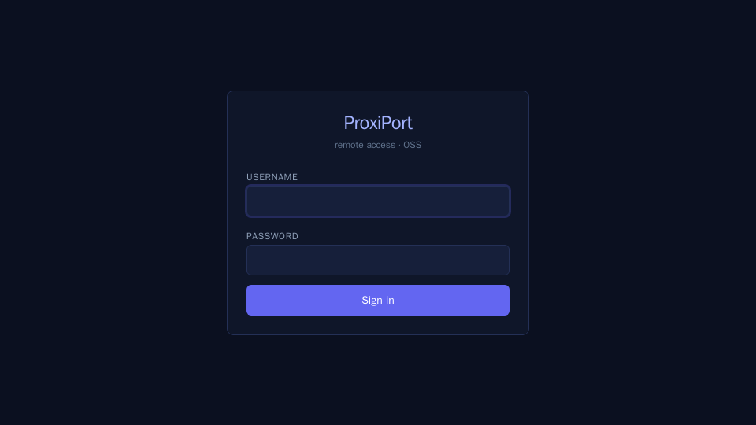
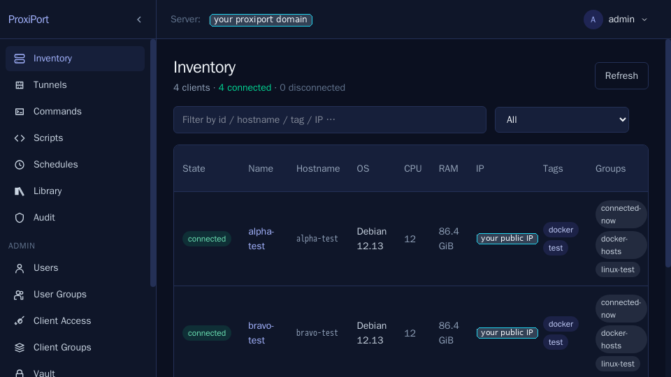

# Install

!!! tip "Just want to see it work?"
    The public demo at
    [`https://demo.proxiport.net/`](https://demo.proxiport.net/) lets
    you sign in (`demo` / `demo`) and explore an Inventory of three
    pre-registered agents without installing anything. State resets
    on the half-hour.

ProxiPort has two pieces: the **server** (`proxiportd`) and the **agent**
(`proxiport`). One server reaches many agents; the agent dials the server
over an outbound WebSocket, so it works behind NAT without inbound
firewall rules.

This page covers a single-server install on Linux and a single Linux
agent. macOS and Windows agents follow the same shape with the
platform-native service manager.

## Server

### Requirements

- Linux x86_64 or arm64 with systemd.
- A public hostname pointed at the host. The **Pick a public listener**
  step below walks through the three TLS setups (built-in ACME, manual
  cert, reverse proxy) — all of them need a hostname.
- Ports 80 and 443 reachable from the network you want agents to
  connect from (80 for the agent listener and ACME HTTP-01 challenges,
  443 for the TLS API).
- SQLite is the default datastore; MySQL is also supported.

### Install

Each release on the
[GitHub releases page](https://github.com/proximile/proxiport/releases)
ships the server for `linux/amd64` and `linux/arm64` in three formats:

- **Debian/Ubuntu `.deb`** — `proxiportd_<ver>_linux_<arch>.deb`
- **Fedora/RHEL/openSUSE `.rpm`** — `proxiportd_<ver>_linux_<arch>.rpm`
- **Tarball** — `proxiportd_<ver>_linux_<arch>.tar.gz`, for other
  distributions

Asset filenames carry the version; the snippets below resolve the
latest tag from the GitHub API before downloading. Substitute `arm64`
for `x86_64` on aarch64 hosts.

#### Debian / Ubuntu

```sh
VER=$(curl -fsSL https://api.github.com/repos/proximile/proxiport/releases/latest \
        | sed -n 's/.*"tag_name": *"\([^"]*\)".*/\1/p')
curl -LO "https://github.com/proximile/proxiport/releases/download/${VER}/proxiportd_${VER#v}_linux_x86_64.deb"
sudo dpkg -i "proxiportd_${VER#v}_linux_x86_64.deb"
```

#### Fedora / RHEL / openSUSE

```sh
VER=$(curl -fsSL https://api.github.com/repos/proximile/proxiport/releases/latest \
        | sed -n 's/.*"tag_name": *"\([^"]*\)".*/\1/p')
sudo rpm -ivh "https://github.com/proximile/proxiport/releases/download/${VER}/proxiportd_${VER#v}_linux_x86_64.rpm"
```

#### Tarball (other distributions)

```sh
VER=$(curl -fsSL https://api.github.com/repos/proximile/proxiport/releases/latest \
        | sed -n 's/.*"tag_name": *"\([^"]*\)".*/\1/p')
curl -LO "https://github.com/proximile/proxiport/releases/download/${VER}/proxiportd_${VER#v}_linux_x86_64.tar.gz"
tar xzf "proxiportd_${VER#v}_linux_x86_64.tar.gz"

sudo install -m 0755 proxiportd /usr/bin/proxiportd
sudo install -d /etc/proxiport
sudo install -m 0644 proxiportd.example.conf /etc/proxiport/proxiportd.conf
sudo install -m 0644 proxiportd.service /lib/systemd/system/proxiportd.service

sudo useradd --system --home /var/lib/proxiport --shell /usr/sbin/nologin proxiport || true
getent group ssl-cert >/dev/null || sudo groupadd --system ssl-cert
sudo install -d -o proxiport -g proxiport -m 0750 /var/lib/proxiport
sudo install -d -o proxiport -g proxiport -m 0750 /var/log/proxiport
sudo setcap CAP_NET_BIND_SERVICE=+eip /usr/bin/proxiportd
sudo systemctl daemon-reload
```

The `ssl-cert` group is listed in the unit's `SupplementaryGroups` so
the daemon can read certbot/manual TLS keys — systemd will not start
the service if the group is missing. `setcap` ships in `libcap2-bin`
(Debian/Ubuntu) or `libcap` (RHEL-family) if your base install lacks
it.

Tarball installs do not auto-generate secrets or seed the config; the
**Configure** step below covers what to set by hand.

#### Building from source

If none of the published artefacts fit your platform — or you want a
container image, which we do not publish — build from source:

```sh
go install github.com/proximile/proxiport/cmd/proxiportd@latest
```

The server needs CGO (`CGO_ENABLED=1`) for the embedded SQLite. The
agent is pure Go.

### Quick setup with `proxiport-setup`

If this is a single-host install with a public hostname pointed at it,
the `proxiport-setup` script bundled with the `.deb` / `.rpm` does
everything below in one command:

```sh
sudo proxiport-setup --fqdn proxiport.example.com
```

It mirrors the upstream openrport curl-bash installer: takes `--fqdn`,
`--email`, `--api-port`, `--client-port`, `--port-range`, `--totp` /
`--no-2fa`; opens UFW or firewalld rules; rewrites `proxiportd.conf` to
bind `:80` for agents and `:443` for the API; turns on built-in ACME if
the hostname is publicly resolvable (or accepts `--cert-file` /
`--key-file` for an existing PEM pair); creates a SQLite
`users`/`groups`/`group_details`/`clients_auth` schema with a
bcrypt-hashed random admin password; enables TOTP 2FA by default;
starts `proxiportd`; and prints the admin URL and credentials.

If that fits your install, jump to **[Log in](#log-in)**. If you want
to lay it out by hand, read on — the remaining sections walk through
exactly what the script automates.

### What just happened

The `.deb` / `.rpm` post-install ran four steps the operator otherwise
has to do manually:

- generated a random ECDSA `key_seed`, JWT signing secret, admin
  password, and first agent credential — all written into
  `/etc/proxiport/proxiportd.conf` in place of the example placeholders;
- recorded the admin and client-auth credentials in two files under
  `/var/lib/proxiport/`:

    ```text
    /var/lib/proxiport/initial-admin-password   # SPA login
    /var/lib/proxiport/initial-client-auth      # first agent's auth pair
    ```

    Both files are mode `0640 root:proxiport`. Read with `sudo cat`.

- granted `CAP_NET_BIND_SERVICE` on `/usr/bin/proxiportd` so the
  unprivileged `proxiport` user can bind ports 80 and 443;
- created `/var/lib/proxiport` (state) and `/var/log/proxiport` (logs)
  with `proxiport` ownership.

The server is **not yet enabled**. The seeded config binds the API to
`127.0.0.1` only, so nothing is reachable from the network until the
next step (or until you run `proxiport-setup`, which handles all of
this in one shot).

At-rest field encryption is **off by default**, so the seeded
`totp_secret` column (and the vault) are stored unencrypted. To wrap
them under a server-held key, configure a `[key_provider]` — see the
`[key_provider]` section of `proxiportd.example.conf` and
[Two-factor authentication](api-authentication.md#two-factor-authentication).

### Pick a public listener

The seeded config leaves `[api] address = "127.0.0.1:3000"` so nothing
is exposed off-box until you choose how TLS will be served. There are
three working setups; pick one and edit `/etc/proxiport/proxiportd.conf`
accordingly. Full walk-through with worked examples is in
[HTTPS](https.md).

=== "Built-in ACME (easiest)"

    Single-purpose host with a public DNS A record pointing at it and
    port 80 reachable from the internet for Let's Encrypt's HTTP-01
    challenge. `proxiportd` obtains and renews the certificate itself.

    ```toml
    [api]
      address     = "0.0.0.0:443"
      base_url    = "https://proxiport.example.com"
      enable_acme = true
    ```

=== "Manual cert files"

    Bring your own cert + key (certbot --manual, internal CA, anything
    PEM). Both files must be readable by the `proxiport` system user.

    ```toml
    [api]
      address   = "0.0.0.0:443"
      base_url  = "https://proxiport.example.com"
      cert_file = "/etc/proxiport/tls/fullchain.pem"
      key_file  = "/etc/proxiport/tls/privkey.pem"
    ```

=== "Reverse proxy"

    nginx / Caddy / Traefik terminates TLS upstream and forwards plain
    HTTP to `proxiportd` over loopback. Keep `address = "127.0.0.1:3000"`
    in the seeded config and point your proxy at it. See
    [HTTPS](https.md#external-reverse-proxy-in-front) for the directives
    each proxy needs for the WebSocket upgrade.

### Open the firewall

Wherever your server runs there is probably one host-level firewall and
one cloud-level firewall. Both need port 80 (for the agent listener and
ACME HTTP-01) and 443 (for the TLS API), unless you went with the
reverse-proxy option.

=== "UFW (Ubuntu)"

    ```sh
    sudo ufw allow 80/tcp
    sudo ufw allow 443/tcp
    ```

=== "firewalld (RHEL / Fedora)"

    ```sh
    sudo firewall-cmd --add-service=http  --permanent
    sudo firewall-cmd --add-service=https --permanent
    sudo firewall-cmd --reload
    ```

=== "DigitalOcean / AWS / GCP"

    On hyperscalers the host firewall above only opens the kernel —
    the cloud's network firewall is what the public internet sees. Add
    inbound TCP rules for `80` and `443` to the droplet's Cloud
    Firewall (DO), the instance's Security Group (AWS), or the VPC
    firewall (GCP).

### Enable the service

```sh
sudo systemctl enable --now proxiportd
sudo systemctl status proxiportd
```

If the unit fails to start, `journalctl -u proxiportd -n 50` shows
why — the most common causes are an `[api] address` that's already in
use, a `base_url` whose hostname does not resolve, or `cert_file` /
`key_file` paths the `proxiport` user cannot read.

### Log in

Read the random admin password generated at install time:

```sh
sudo cat /var/lib/proxiport/initial-admin-password
```

Open `https://<your-host>/` in a browser and sign in. Rotate the
password from the Profile screen once you're in.



The **Info** page is where the host-key fingerprint and the
Connect-URL list live — both are needed when configuring agents.


## Agent

### Requirements

- Linux / macOS / Windows.
- Outbound TCP from the agent host to the server's `[server]`
  listener — port 80 in the seeded default. Agents never accept
  inbound connections, so no firewall changes are needed on their
  side.

### Install

The fastest way to bring up a new agent is the **pairing service** at
[`pairing.proxiport.net`](https://pairing.proxiport.net/): the operator
posts the agent's credentials, the service mints a one-shot pairing
code, the agent host runs

```sh
curl https://pairing.proxiport.net/<code> | sudo sh
```

and the installer drops a working binary plus `proxiport.conf` into
place. Source for the pairing service: <https://github.com/proximile/proxiport-pairing>.

The agent ships in the same three package formats as the server, plus
tarballs for a wider platform list: linux (amd64, arm64, i386, armv6,
armv7, mips/mipsle/mips64/mips64le hard- and softfloat, s390x), macOS
(amd64, arm64), Windows (amd64), and FreeBSD (amd64, arm64, armv6,
armv7, i386). `.deb` and `.rpm` are published for every Linux variant.

#### Manual install — Debian / Ubuntu

```sh
VER=$(curl -fsSL https://api.github.com/repos/proximile/proxiport/releases/latest \
        | sed -n 's/.*"tag_name": *"\([^"]*\)".*/\1/p')
curl -LO "https://github.com/proximile/proxiport/releases/download/${VER}/proxiport_${VER#v}_linux_x86_64.deb"
sudo dpkg -i "proxiport_${VER#v}_linux_x86_64.deb"
```

#### Manual install — Fedora / RHEL / openSUSE

```sh
VER=$(curl -fsSL https://api.github.com/repos/proximile/proxiport/releases/latest \
        | sed -n 's/.*"tag_name": *"\([^"]*\)".*/\1/p')
sudo rpm -ivh "https://github.com/proximile/proxiport/releases/download/${VER}/proxiport_${VER#v}_linux_x86_64.rpm"
```

#### Manual install — tarball (other platforms)

```sh
VER=$(curl -fsSL https://api.github.com/repos/proximile/proxiport/releases/latest \
        | sed -n 's/.*"tag_name": *"\([^"]*\)".*/\1/p')
curl -LO "https://github.com/proximile/proxiport/releases/download/${VER}/proxiport_${VER#v}_linux_x86_64.tar.gz"
tar xzf "proxiport_${VER#v}_linux_x86_64.tar.gz"

sudo install -m 0755 proxiport /usr/bin/proxiport
sudo install -d /etc/proxiport
sudo install -m 0644 proxiport.example.conf /etc/proxiport/proxiport.conf
sudo install -m 0644 proxiport.service /lib/systemd/system/proxiport.service
sudo systemctl daemon-reload
```

### Configure the agent

Edit `/etc/proxiport/proxiport.conf` and set three fields:

```toml
[client]
  server      = "your-proxiport-server.example.com:80"
  auth        = "<client-auth-id>:<password>"
  fingerprint = "<server-host-key-fingerprint>"
```

- **`server`** — the address the agent dials. Port should match what the
  proxiportd `[server]` listener was bound to; the seeded default is 80.
- **`auth`** — pull the first credential off the server with
  `sudo cat /var/lib/proxiport/initial-client-auth`, or any later
  credential you've created. Both halves of `<id>:<password>` go in.
- **`fingerprint`** — the proxiportd host-key fingerprint, printed in
  the server's log on first boot and shown on the SPA's **Info** page.
  Without it, the agent will accept whatever public key the server
  presents — fine for testing, never for production.

Then start the service:

```sh
sudo systemctl enable --now proxiport
```

The agent connects, registers, and waits for tunnel-open requests from
the server. It reconnects automatically.

Refresh the SPA. The new agent shows up in the inventory.



## Upgrading from a v0.1.2 install

v0.1.3 changes two things that already-running v0.1.2 installs do not
pick up automatically — the package postinstall deliberately leaves an
existing `/etc/proxiport/proxiportd.conf` alone.

- **`[api] address` default moved from `0.0.0.0:3000` to `127.0.0.1:3000`.**
  v0.1.2 servers that have always relied on the example config will
  still listen on 3000 publicly until you switch them onto one of the
  three public-listener profiles above. Until then, the API is reachable
  on plain HTTP, which is exactly what the v0.1.3 defaults are meant
  to stop.
- **Random secrets and initial credential files** are only generated on
  first install. If you set `key_seed` / `jwt_secret` / `[api] auth`
  yourself when bringing v0.1.2 up, nothing to do. If you left them at
  the example placeholders (`<YOUR_SEED>`, `<YOUR_SECRET>`,
  `admin:foobaz`, `clientAuth1:1234`), generate replacements manually
  before upgrading — `openssl rand -hex 32` for the seed,
  `openssl rand -base64 24` for the JWT secret, anything strong for
  the auth strings.

Otherwise the upgrade is `dpkg -i` / `rpm -Uvh` of the new package and
`systemctl restart proxiportd`. Config schema is unchanged.

## Migrating from rport or openrport

ProxiPort's config file format is intentionally compatible with the
upstream `rportd.conf` and `rport.conf`. Tags and option names are
unchanged where the underlying behaviour is unchanged.

To migrate:

1. Stop the upstream service (`rportd` or `openrportd`).
2. Install ProxiPort using the Debian/Ubuntu, Fedora/RHEL, or tarball
   path above.
3. Copy your existing `rportd.conf` to `/etc/proxiport/proxiportd.conf`.
4. Start `proxiportd`.
5. On each agent, replace the upstream binary, copy the config to
   `/etc/proxiport/proxiport.conf`, and start `proxiport`. Re-issue
   the `fingerprint` if the server's host key has changed.

The datastore schema is forwards-compatible from the openrport tree;
ProxiPort runs any pending migrations on first start.

## What does not change from upstream

- **Config file format** — TOML, structurally compatible with
  `rportd.conf` / `rport.conf`.
- **Tunnel transport defaults** — chisel over WebSocket. Serve it
  over TLS in production (built-in `cert_file`/`enable_acme` on the
  server, or an external reverse proxy — see [HTTPS](https.md)).
- **Datastore** — SQLite by default, MySQL supported.
- **REST API surface** — the same endpoints, the same response shapes.
  See the API reference.
