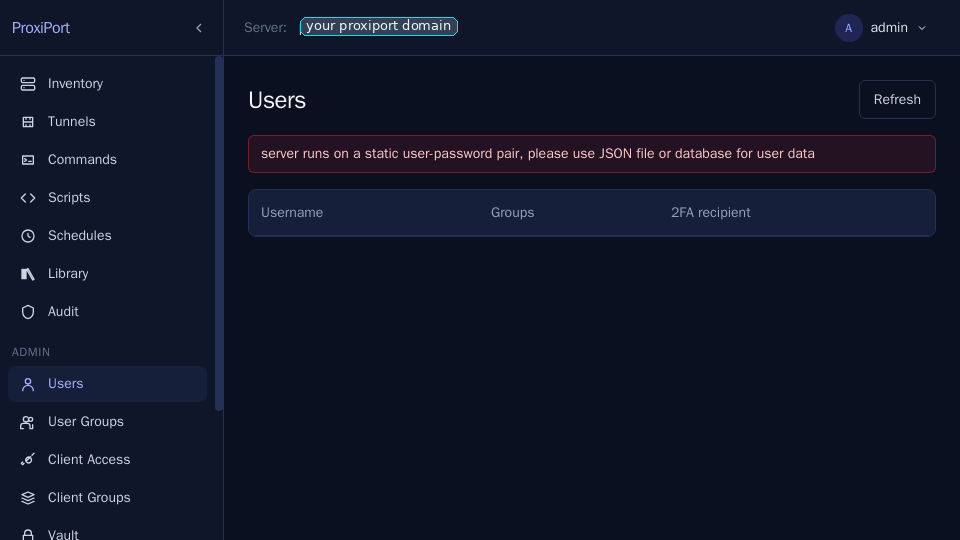
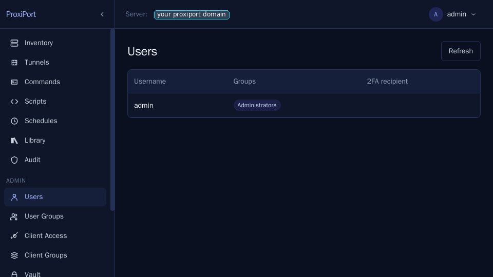
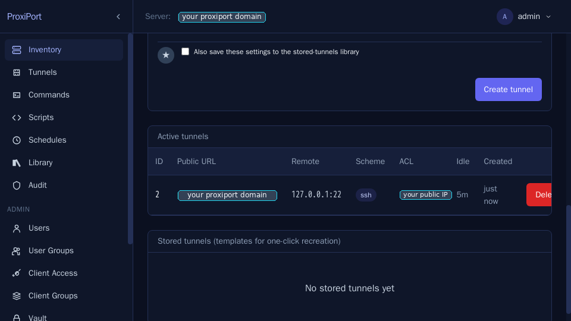
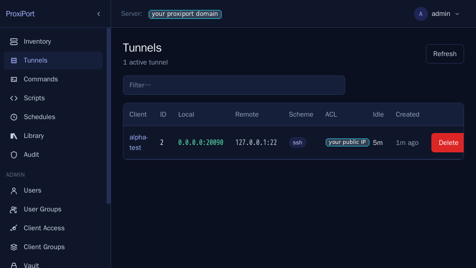
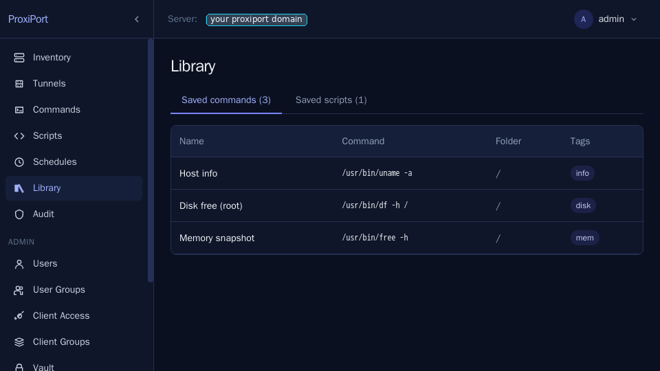
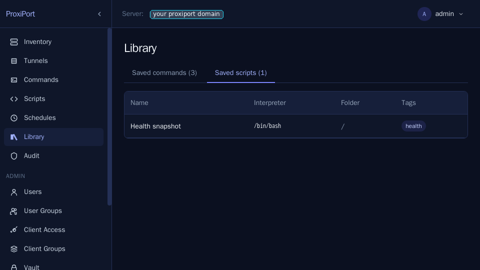
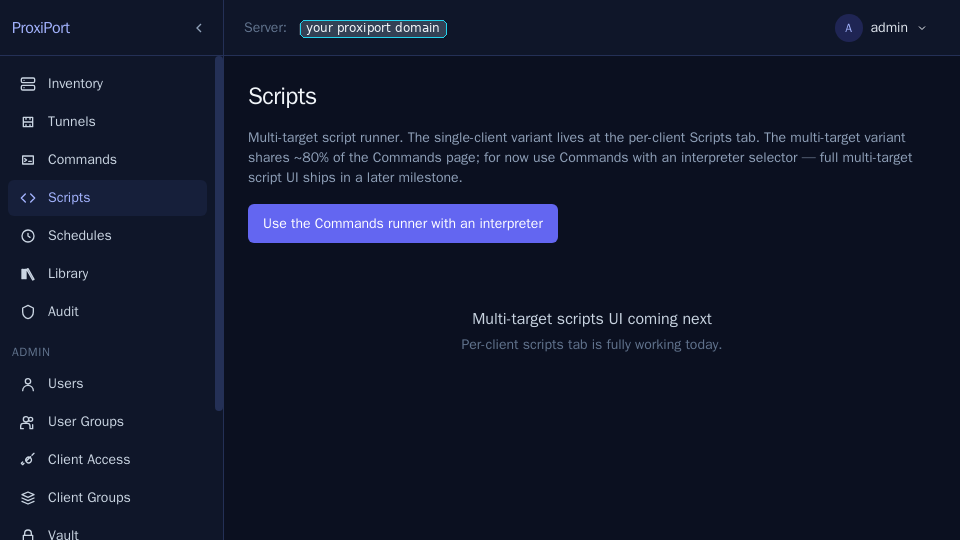
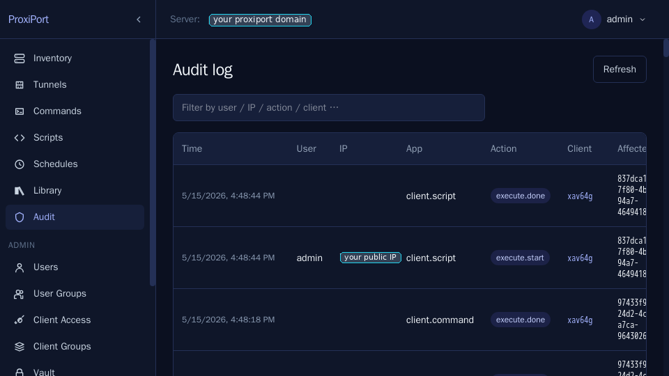
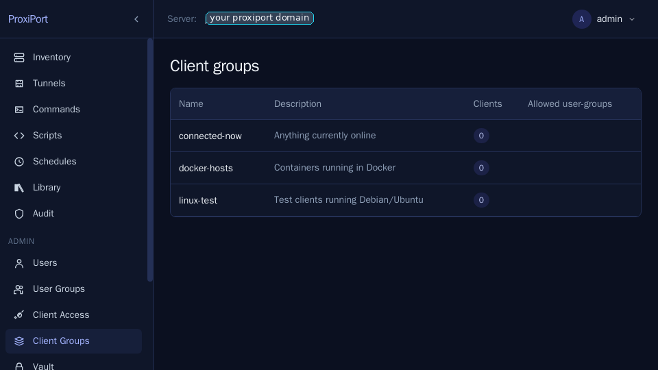

# Operator runbook

Short reference for keeping a ProxiPort server healthy. Not a full
admin guide — see [install](install.md) and [migration](migration.md)
for the first-run setup.

## Service control

```sh
# Server
sudo systemctl status proxiportd
sudo systemctl restart proxiportd
sudo journalctl -u proxiportd -f

# Agent
sudo systemctl status proxiport
sudo systemctl restart proxiport
sudo journalctl -u proxiport -f
```

## Paths

| Purpose | Path |
| --- | --- |
| Server config | `/etc/proxiport/proxiportd.conf` |
| Server data | `/var/lib/proxiport/` |
| Server SPA files | `/var/lib/proxiport/docroot/` |
| Server logs (default) | `/var/log/proxiport/proxiportd.log` (and journald) |
| Server PID file | `/run/proxiportd.pid` |
| Agent config | `/etc/proxiport/proxiport.conf` |
| Agent log | journald (`-u proxiport`) |

## Backups

The server keeps everything that matters in two places:

- **SQLite databases** under `/var/lib/proxiport/`. The set as of
  this writing: `clients.db`, `monitoring.db`, `library.db`,
  `auditlog.db`, `api_sessions.db`, `api_token.db`,
  `client_groups.db`, `jobs.db`, `notifications.db`, and the vault
  store at `vault.sqlite.db`. Each is created on demand the first
  time the corresponding feature is touched, so an early-life
  install may not have all of them on disk. Back the directory up
  with a stop-the-world snapshot or with the SQLite `.backup`
  command for hot backups.
- **`/etc/proxiport/proxiportd.conf`** — the config with the
  pinned `key_seed`, `jwt_secret`, and admin credentials.

User auth lives either in a JSON file (`[api] auth_file = "..."`)
or in a table inside the main database (`[api] auth_user_table =
"users"` plus a configured `[database]` connection), so back those
up alongside the SQLite files as appropriate.

Tarball both directories for the simplest backup. Restore by
stopping the service, replacing the directories, and starting again.

If you use MySQL instead of SQLite (`[database] db_type = "mysql"`
in proxiportd.conf), back up the database with your usual MySQL
tooling.

The **vault** is a special case. It is encrypted at rest with a
passphrase that is never written to disk, so a server restart always
re-locks it — back up `vault.sqlite.db` alongside the other databases
and remember that restoring it requires re-entering the passphrase
through the SPA before the documents and per-client secrets are
readable again.


## Rotating credentials

- **Admin password.** Edit `/etc/proxiport/proxiportd.conf`,
  change the `[api] auth = "admin:<new-password>"` line, restart
  the service. Or, if running a multi-user setup with `auth_file`,
  edit that JSON file or the corresponding DB row.

  The Users page surfaces a banner whenever auth is pinned in the
  config (`[api] auth = "admin:..."`) rather than user-managed —
  rotating in that mode is a config edit + restart, not a SPA action.

  
- **JWT secret.** `[api] jwt_secret = "<long-random-string>"` —
  rotating this invalidates every issued session immediately. All
  users will be redirected to `/auth`.
- **`key_seed`.** Rotating the seed changes the server's SSH host
  key. Every connected agent will fail the fingerprint check
  until its `proxiport.conf` is updated. Avoid rotating unless the
  seed is compromised; coordinate with all agent operators.
- **client-auth credentials.** Used by agents to register. Change
  via `[server] auth = "<id>:<password>"` (single credential), or
  via the JSON file pointed at by `[server] auth_file`, or via the
  table named in `[server] auth_table`. Push the new credentials
  to each agent and restart it.

  When `auth_file` mode is in use, the credentials are also
  manageable from the SPA at **Client Access**:

  

- **API tokens.** For programmatic API consumers, mint scoped API
  tokens at **API Tokens** rather than reusing a human's
  username/password. Tokens carry a lifetime and an explicit
  scope (`read`, `read+write`, …) and are revocable independently.

  

- **TOTP second factor.** Set `[api] totp_enabled = true` in
  `proxiportd.conf`, restart, and each user is prompted to enroll on
  their next login. The user scans the SPA's QR with any RFC 6238
  TOTP app:

  

  Admins can require an existing user to re-enroll from the **Users**
  page:

  

  Once enabled at the server, the Info page reflects the new
  posture:

  

  Each user's profile shows their TOTP enrollment state and lets
  them reset it:

  

## Capacity and limits

- **Connected agents per server.** SQLite handles a few hundred
  agents comfortably on modest hardware. For more, switch to
  MySQL.
- **Tunnel ports.** `[server] used_ports` controls the pool of
  ports the server may allocate for tunnels. Default `20000-30000`.
  Expand if you run out.
- **Per-user session lifetime.** `?token-lifetime=<seconds>` on
  `/login`; defaults to 10 minutes; the SPA asks for 24 hours.

## Updating

1. Stop the service.
2. Replace the binary in `/usr/local/bin/proxiportd` (or wherever
   your package manager put it).
3. Start the service. Schema migrations, if any, run on first
   start.
4. Tail the logs to confirm.

For the agent, the same shape applies on each managed host.

## Tunnels

A tunnel is a per-session listener on the server that forwards
traffic back to a TCP port on the agent. Open one from a client's
**Tunnels** tab.

![Tunnel create form — pick the agent-side address, the public
scheme, and an ACL. The server allocates the public port from
`[server] used_ports` unless you pin it
manually.](screenshots/04-tunnel-create-form.png)

The ACL is enforced at the server's listener, not at the agent —
denied traffic never crosses the chisel session. `Only my current
IP address` is the default preset and reads the request's
`X-Forwarded-For` (set this in your reverse proxy).



Tunnels also accept inactivity / lifetime caps, after which the
server closes the listener and notifies the agent.


You can save a tunnel definition into the **Stored tunnels**
library to re-open it later in one click.


The global **Tunnels** page is the operator's at-a-glance view
across every connected agent.



## Commands and scripts

ProxiPort can run ad-hoc commands or multi-line scripts against any
connected agent and stream the output back. The agent has to opt in
via `commands_allow` / `commands_deny` in its `proxiport.conf` —
running everything by default is intentionally not the shape.


When a command is allowed, the SPA streams stdout / stderr live
and prints the exit code at the end.


Scripts are the same control surface with a multi-line editor and
an interpreter selector (`/bin/bash`, `/usr/bin/python3`, …). The
agent writes the body to a tempfile, executes, and reaps the
process.


For repeated patterns, save commands and scripts into the
**Library**:





A library entry can be run against multiple agents at once from
the **Commands** page — useful for one-shot fleet
work.


The global **Scripts** page is the same concept for whole-fleet
script runs. It is still being reimplemented from the upstream
shape — at the moment it is a stub that links into the per-client
Scripts tab.



## Schedules

For recurring runs, attach a cron expression to a saved command or
script. The scheduler is in-process; no external cron is needed.


## File transfer

Push a file from the server's filesystem (or paste it inline) to a
chosen path on the agent. The transfer goes over the same chisel
session as everything else.


## Audit log

Every state-changing API call writes an `auditlog.db` row with the
user, client (if any), action, timestamp, and the request payload.
The per-client view filters the same table down to events touching
one agent:


The global **Audit** page is for cross-cutting queries — who
created which tunnel, who rotated which credential.



## User and group admin

User groups gate which API endpoints (and therefore which SPA
sections) each user can reach. The default `admin` group has every
permission set; build new groups by ticking only the columns the
role needs.


Client groups are operator-side labels you can attach to any
agent. They are useful as targeting filters for the multi-target
command page and for the audit-log query
builder.



Each user has a profile page that shows their group membership
and lets them rotate their own password.

![Profile page in static-auth mode — password rotation is gated
behind the same `[api] auth` config edit when running pinned auth;
in `auth_file` mode it is a self-service action.](screenshots/31-profile-staticauth.png)

## Common pitfalls

- **`429 too many requests` immediately after a 401.** ProxiPort
  inherits openrport's `BanList`: every failed auth attempt buys a
  2-second deny on the keyed username. If the SPA fires three
  parallel API calls after a session expires, the first 401s and
  the rest 429. The SPA fixes this client-side by short-circuiting
  on a missing token; if you are writing your own client, do the
  same.
- **Agent refuses to connect with "fingerprint mismatch".** Either
  the server's `key_seed` changed or the agent's
  `fingerprint = "..."` value is stale. Compare the fingerprint
  printed in the server log at startup against the agent config.
- **SPA shows the vault as locked even after entering the
  passphrase.** Vault passphrases are *not* persisted server-side
  — they live in memory for the life of the process. A server
  restart re-locks the vault. Enter the passphrase again via
  `Settings → Vault`.

## Where to get help

- File a bug or feature request on the GitHub repository.
- Private vulnerability reports go through GitHub Security
  Advisories — see [`SECURITY.md`](https://github.com/proximile/proxiport/blob/main/SECURITY.md).
